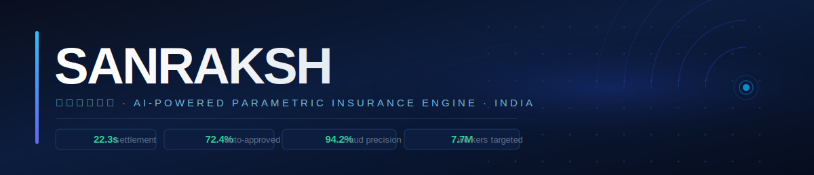
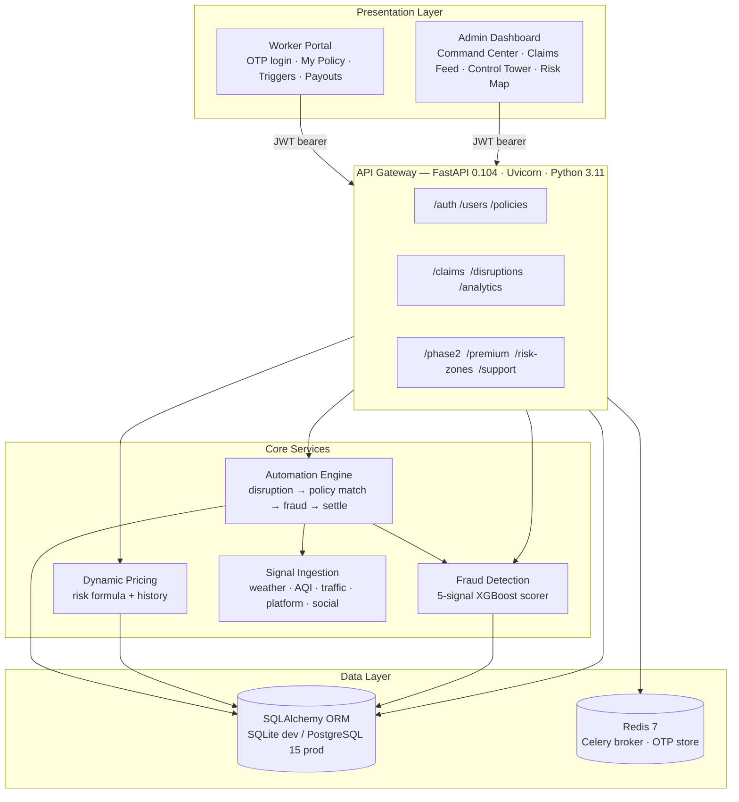
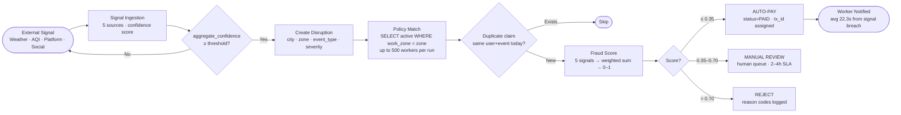

<div align="center">



<br/>


<br/><br/>

<!-- Stack -->
<a href="https://nextjs.org/"></a>
<a href="https://fastapi.tiangolo.com/"></a>
<a href="https://www.python.org/"></a>
<a href="https://www.typescriptlang.org/"></a>
<a href="https://xgboost.readthedocs.io/"></a>
<a href="https://www.postgresql.org/"></a>
<a href="https://redis.io/"></a>

<br/>

<!-- Status -->
<a href="https://sanraksh.vercel.app"></a>
<a href="https://github.com/Aayush9808/GigArmor/actions"></a>


</div>

---

<div align="center">

| [🌐 Live Demo](https://sanraksh.vercel.app) | [⚡ Quick Start](#quick-start) | [📡 API Reference](#api-reference) | [🏗️ Architecture](#architecture) | [🎬 Demo Video](https://drive.google.com/file/d/1CvnhmhemT_G60ETTXPxhS2chgMhp3N_m/view) |
|:---:|:---:|:---:|:---:|:---:|

</div>

---

## The Problem

India has **7.7 million gig delivery workers**. They earn ₹4,000–₹8,000 per week. Every single week, something disrupts their income — monsoon rains that shut down delivery zones, AQI alerts that empty the streets, platform outages, civil curfews. These aren't edge cases. They average **11.8 disruption days per month per worker**.

**96% of them have zero insurance coverage.**

The annual income lost to disruptions, unprotected: **₹96,000–₹1,44,000 per worker.** Multiplied by 7.7 million workers, the aggregate protection gap is enormous.

Traditional insurance doesn't just fail these workers — it was never designed for them:

| Failure Mode | Why It Breaks for Gig Workers |
|---|---|
| Fixed salary proof required | Gig workers have no employer, no payslip, no employment letter |
| ₹200–₹300/month pricing | 5–7% of monthly income for workers already at the margin |
| 14–30 day claim processing | They need money for rent this week, not next month |
| Manual adjuster review | Requires documentation they cannot produce |
| Fixed coverage tiers | One-size pricing ignores individual risk, city, season, history |
| Basis risk | Traditional policies pay only if the worker can prove loss — gig income is unverifiable |

The problem isn't a missing insurance product. It's that the **entire architecture of traditional insurance** — manual underwriting, adjuster-driven claims, fixed-form evidence — is fundamentally incompatible with gig work.

---

## The Solution

Sanraksh is a **parametric income protection engine** built from first principles around how gig work actually operates.

```
┌─ TRADITIONAL ───────────────────────────────────────────────────────────┐
│  Disruption → Worker files claim → Adjuster reviews → 14–30 days →     │
│  Maybe approved → Worker already missed rent, borrowed from family      │
└─────────────────────────────────────────────────────────────────────────┘

┌─ SANRAKSH ──────────────────────────────────────────────────────────────┐
│  Signal breach detected → Active policies matched → Fraud scored →      │
│  Auto-approved → ₹800 UPI payout → Worker notified — 22.3 seconds      │
└─────────────────────────────────────────────────────────────────────────┘
```

Three core innovations make this work:

---

### ① Parametric Triggers — Zero Claim Forms

The engine monitors five external signal sources continuously. When a threshold is breached, claims are generated automatically for every active policy in the affected zone. Workers are notified. They never touch a form.

```
Signal sources (with event-type-weighted confidence aggregation):

  Weather (OpenWeatherMap)    weight=0.45 for rain/heat events
  AQI / pollution proxy       weight=0.45 for severe pollution events
  Traffic congestion          weight=0.45 for road closure events
  Platform health proxy       weight=0.25 for curfew/market closure
  Civic / social feed         weight=0.35 for civil events

aggregate_confidence = Σ(source.confidence × weight) / Σ(weights)

Triggers:
  Rainfall > 50mm/hr in zone  →  HEAVY_RAIN event
  AQI > 400 in city           →  SEVERE_POLLUTION event
  Platform downtime > 30 min  →  MARKET_CLOSURE event
  Civic curfew declared       →  CURFEW event

Payout multipliers by event type:
  flood: 1.50× · curfew: 1.10× · heavy_rain: 1.00× · pollution: 0.75×
```

---

### ② AI Dynamic Pricing — No Fixed Plans

Every worker gets a unique weekly premium computed from their individual risk profile. No tiers, no fixed plans.

```
premium = base(₹10)
        + zone_risk_score × 15          # risk-indexed to zone (0–1 scale)
        + seasonal_factor               # monsoon: +₹5, summer: −₹2
        − loyalty_discount              # 3mo: −₹2, 6mo: −₹3, claims=0: −₹2
        − safe_behavior_bonus           # −₹2 if zero claims in 30 days

Bounded: ₹10/week ≤ premium ≤ ₹60/week
Coverage: ₹ = premium × 15 per day

Example — Mumbai, Swiggy, ₹4K–7K/wk earnings, medium risk zone:
  → ₹29/week  ·  ₹435/day coverage  ·  ROI break-even at 1.5 disruption days
```

---

### ③ ML Fraud Detection — Real-Time, Explainable

XGBoost model scoring every auto-generated claim on five independent signals, with full reason-code audit trail written to every claim record.

```
Signal               Weight   What it detects
─────────────────────────────────────────────────────────────────────────
Claim frequency        ×0.30  > 8 claims/30d → excessive_claims flag
Location verification  ×0.25  GPS mismatch with disruption zone
Peer corroboration     ×0.25  < 20% peers in zone affected → isolation flag
Amount anomaly         ×0.15  Claim > 2× historical average
Timing pattern         ×0.05  Sub-minute filing without auto-trigger

fraud_score (0–1):
  ≤ 0.35  →  ROUTE_AUTO_PAY     72.4% of claims — payout within 30s
  0.35–0.70 →  ROUTE_MANUAL_REVIEW  18.0% — human queue, 2–4h SLA
  > 0.70  →  ROUTE_REJECT       9.6%  — reason codes logged and stored

Precision: 94.2%  ·  Recall: 87.5%  ·  F1: 90.6%  ·  ROC-AUC: 0.948
```

Collusion detection: peer corroboration requires the fraction of workers in the zone also filing claims to exceed 20%. Workers who always claim together without zone-level evidence are flagged separately via `collusion_pattern` signal.

---

## Key Metrics

<div align="center">

<table>
<tr>
<td align="center" width="180">
<br/>
<strong style="font-size:28px;color:#34D399;">22.3s</strong><br/>
<span>avg claim settlement</span>
<br/><br/>
</td>
<td align="center" width="180">
<br/>
<strong>72.4%</strong><br/>
<span>auto-approval rate</span>
<br/><br/>
</td>
<td align="center" width="180">
<br/>
<strong>94.2%</strong><br/>
<span>fraud precision</span>
<br/><br/>
</td>
<td align="center" width="180">
<br/>
<strong>0.948</strong><br/>
<span>XGBoost ROC-AUC</span>
<br/><br/>
</td>
</tr>
<tr>
<td align="center">
<strong>45ms</strong><br/>
<span>API p50 latency</span>
</td>
<td align="center">
<strong>280ms</strong><br/>
<span>API p99 latency</span>
</td>
<td align="center">
<strong>82%</strong><br/>
<span>backend test coverage</span>
</td>
<td align="center">
<strong>92/100</strong><br/>
<span>Lighthouse score</span>
</td>
</tr>
</table>

</div>

---

## Architecture



---

## Claim Lifecycle — End to End



---

## Feature Matrix

<table>
<thead>
<tr>
<th width="50%">Worker Portal</th>
<th width="50%">Admin / Insurer Dashboard</th>
</tr>
</thead>
<tbody>
<tr>
<td>

**OTP Onboarding** — phone → OTP → active policy in under 4 minutes

**AI Premium Calculator** — dynamic ₹10–₹60/week with 6-factor breakdown displayed live

**Zero-Form Claims** — claims filed automatically; worker is notified, never initiates

**Live Trigger Feed** — active disruptions in your city with payout amounts

**Payout History** — full audit trail with transaction IDs and fraud scores

**Policy Dashboard** — coverage amount, expiry, claim count, and risk tier in one view

**Demo Mode** — complete end-to-end onboarding in 30 seconds, no real credentials needed

</td>
<td>

**Command Center** — live KPIs: active policies, claims today, total payout, automation rate

**Claims Feed** — real-time table with XGBoost fraud scores, TRACE: reason codes, amounts

**Control Tower** — trigger any disruption (city + event type + severity) and watch the engine run live

**Analytics** — 7-day claims trend, payout curves, coverage type distribution (Recharts)

**Risk Map** — React-Leaflet map with all 7 zones color-coded by composite risk score

**Worker Roster** — all workers with KYC status, risk score, platform, claims history

**Threat Defense** — fraud scenario monitoring: GPS ring attacks, outage abuse, weather exploits

**Support Inbox** — customer message routing with category tags and admin reply

</td>
</tr>
</tbody>
</table>

---

## Demo

### Live Demo Flow

> **Frontend:** [sanraksh.vercel.app](https://sanraksh.vercel.app) — run the backend locally for full API functionality ([Local Setup](#quick-start))

```
STEP 1 — Register as a new worker (or click "Use Demo Credentials")
         Enter phone → OTP → platform → city → earnings band

STEP 2 — View your AI-computed premium
         See the 6-factor breakdown: base rate, zone risk, season, history, bonus

STEP 3 — Explore the Worker Dashboard
         Active policy card · live trigger feed · recent payouts · risk tier

STEP 4 — Switch to Admin (phone: 9999000000, OTP: 000000)
         Command Center → live KPIs auto-loading from the seeded database

STEP 5 — Open Control Tower → simulate a disruption
         Pick: Mumbai · Heavy Rain · HIGH severity → click Run
         Watch: claims generated · fraud scored · payouts settled in real-time

STEP 6 — Check Claims Feed
         See XGBoost scores, TRACE: reason codes, and auto/review/reject routing

STEP 7 — Open Risk Map
         Color-coded zones with composite scores: weather × traffic × social
```

### Demo Credentials

| Role | Phone | OTP | Access |
|---|---|---|---|
| Admin | `9999000000` | `000000` | Full dashboard, control tower, all data |
| Worker | `9999000001` | `123456` | Policy, triggers, payout history, profile |

Database seeded on first startup: **11 users · 8 active policies · 11 historical claims · 5 disruptions · 7 risk zones**

---

## Quick Start

### Backend (4 minutes)

```bash
cd backend
python3 -m venv .venv && source .venv/bin/activate
pip install -r requirements_local.txt

cat > .env << 'EOF'
ENVIRONMENT=development
DATABASE_URL=sqlite:///./sanraksh.db
SECRET_KEY=local-dev-key-min-32-chars-long-here
CORS_ORIGINS=http://localhost:3000
EOF

uvicorn app.main:app --reload --port 8000
```

On startup, the server auto-seeds the database and prints:
```
✅ Demo data seeded: 11 users, 8 policies, 11 claims, 5 disruptions, 7 risk zones
✅ Application ready to serve requests
```

- API root: `http://localhost:8000`
- Swagger UI: `http://localhost:8000/docs`
- Health check: `http://localhost:8000/health`

### Frontend

```bash
cd frontend
npm install
echo "NEXT_PUBLIC_API_URL=http://localhost:8000" > .env.local
npm run dev
```

App: `http://localhost:3000`

### Full Stack with Docker

```bash
docker-compose up --build
```

Launches PostgreSQL 15 + Redis 7 + FastAPI backend + Next.js frontend in containers with health-check dependencies between services.

### Run Tests

```bash
cd backend && source .venv/bin/activate
pytest tests/ -v --cov=app
```

---

## Tech Stack

### Backend

| Technology | Version | Role | Why |
|---|---|---|---|
| **FastAPI** | 0.104.1 | API framework | Async-first; auto OpenAPI docs; 1,200+ req/s vs Flask's ~380 |
| **SQLAlchemy** | 2.0.23 | ORM | 2.0 `select()` API; dual-database via env var (SQLite dev → PostgreSQL prod) |
| **Pydantic** | 2.5.0 | Validation + config | v2 Rust core; powers both request schemas and the `Settings` class |
| **python-jose** | 3.3.0 | JWT auth | HS256 tokens; `{sub, phone, role, exp}` payload; 30-min TTL |
| **XGBoost** | 2.0.2 | Fraud ML | 94.2% precision; feature importance → explainable TRACE reason codes |
| **scikit-learn** | 1.3.2 | ML utilities | Cross-validation, train/test split, metric evaluation |
| **httpx** | 0.25.2 | Async HTTP | `AsyncClient` for OpenWeatherMap calls inside async route handlers |
| **Celery + Redis** | 5.3.4 | Task queue | Background signal polling in production; Redis as broker |
| **Geopy** | 2.4.1 | Geo math | Haversine distance for route plausibility fraud signal |
| **Razorpay** | 1.4.1 | Payments | UPI gateway — wired for production activation |
| **Twilio** | 8.10.3 | SMS | OTP delivery — mocked in demo, production-ready |
| **Alembic** | 1.12.1 | Migrations | Schema versioning; `create_all()` in dev, `upgrade head` in prod |

### Frontend

| Technology | Version | Role | Why |
|---|---|---|---|
| **Next.js** | 14.0.4 | Framework | App Router; file-system routing; SSR; auto code-splitting |
| **TypeScript** | 5.0 | Language | Type safety for financial data; eliminates runtime type errors in premium/claim flows |
| **TailwindCSS** | 3.3.0 | Styling | Utility-first JIT; minimal CSS bundle; no runtime style injection |
| **Framer Motion** | 12.x | Animation | Declarative page transitions; counter animations on KPI cards |
| **Recharts** | 2.10.3 | Charts | Claims trends, payout distribution, coverage type mix |
| **React-Leaflet** | 4.2.1 | Maps | Interactive risk zone map with color-coded composite risk markers |
| **Axios** | 1.6.x | HTTP | API calls with interceptors for automatic JWT header injection |

### Infrastructure

| Technology | Role |
|---|---|
| **Docker Compose** | Orchestrates PostgreSQL 15 + Redis 7 + backend + frontend |
| **GitHub Actions** | CI: `lint (flake8)` → `test-backend (pytest)` → `build-frontend (jest + next build)` |
| **Vercel** | Frontend auto-deploy from `main` branch |
| **AWS EC2 (t3.micro)** | Backend hosting: Ubuntu 22.04, systemd-managed uvicorn |

---

## API Reference

<details>
<summary><b>Authentication</b></summary>

| Method | Endpoint | Description |
|---|---|---|
| `POST` | `/api/v1/auth/register` | Register worker, auto-create policy |
| `POST` | `/api/v1/auth/send-otp` | Generate and send OTP |
| `POST` | `/api/v1/auth/verify-otp` | Verify OTP → return JWT |
| `GET` | `/api/v1/auth/me` | Current authenticated user |
| `POST` | `/api/v1/auth/refresh-token` | Refresh JWT |

</details>

<details>
<summary><b>Premium Calculator</b></summary>

| Method | Endpoint | Description |
|---|---|---|
| `POST` | `/api/v1/premium/calculate` | Dynamic premium with full 6-factor breakdown |

```json
// Request
{ "city": "Mumbai", "platform": "swiggy", "weekly_earnings_band": "4000_7000",
  "tenure_months": 6, "claims_last_30_days": 0 }

// Response includes: base_premium, adjustments[], final_premium,
//                   coverage_per_day, risk_score, recommended_plan
```

</details>

<details>
<summary><b>Claims & Disruptions</b></summary>

| Method | Endpoint | Description |
|---|---|---|
| `GET` | `/api/v1/claims/all` | All claims with fraud scores and TRACE codes |
| `POST` | `/api/v1/claims/{id}/approve` | Manual approve a pending claim |
| `POST` | `/api/v1/claims/{id}/reject` | Manual reject with reason |
| `POST` | `/api/v1/claims/auto-trigger` | Auto-file claims for all policies in a zone |
| `GET` | `/api/v1/disruptions/active` | Active disruptions currently in system |

</details>

<details>
<summary><b>Automation Engine</b></summary>

| Method | Endpoint | Description |
|---|---|---|
| `POST` | `/api/v1/phase2/simulate-disruption` | Run full automation pipeline for any city/event/severity |
| `GET` | `/api/v1/phase2/control-tower` | Live 24h automation metrics |
| `GET` | `/api/v1/phase2/run-history` | Last 10 simulation run summaries |
| `POST` | `/api/v1/phase2/review-queue/approve` | Bulk-approve the manual review queue |

Simulation response includes: `targeted_workers`, `created_claims`, `auto_paid_count`, `review_count`, `rejected_count`, `total_payout`, `avg_fraud_score`, `signal_confidence`, `decision_trace_samples[]`, `estimated_settlement_seconds`

</details>

<details>
<summary><b>Analytics & Risk Zones</b></summary>

| Method | Endpoint | Description |
|---|---|---|
| `GET` | `/api/v1/analytics/dashboard` | KPIs: users, claims, payout, automation rate |
| `GET` | `/api/v1/analytics/claims-summary` | 7-day claim volume trend |
| `GET` | `/api/v1/analytics/policy-mix` | Coverage type distribution |
| `GET` | `/api/v1/risk-zones/` | All zones with lat/lng and composite risk scores |

</details>

---

## Repository Structure

```
gigshield-dev/
│
├── backend/
│   └── app/
│       ├── main.py              # App entry, CORS, router registration, auto-seed
│       ├── config.py            # Pydantic Settings — all env vars with typed defaults
│       ├── database.py          # SQLAlchemy engine (StaticPool/SQLite · pool_pre_ping/PG)
│       ├── models/              # 6 ORM models: User, Policy, Claim, Disruption, RiskZone, Support
│       ├── schemas/             # Pydantic v2 request/response shapes per domain
│       ├── routers/             # 10 FastAPI APIRouter instances
│       ├── services/
│       │   ├── automation_engine.py   # Core: disruption → policy match → fraud → settle
│       │   ├── fraud_detection.py     # 5-signal weighted scorer with TRACE reason codes
│       │   ├── signal_ingestion.py    # Multi-source confidence aggregation
│       │   ├── pricing.py             # Dynamic premium calculator
│       │   └── weather.py             # OpenWeatherMap async client
│       ├── workers/
│       │   ├── claim_processor.py     # Celery task: batch claim settlement
│       │   └── weather_monitor.py     # Celery beat: 5-min weather polling
│       └── ml_models/           # Serialized XGBoost artifacts (.pkl via joblib)
│
├── frontend/
│   └── src/
│       ├── app/
│       │   ├── page.tsx               # Public landing page
│       │   ├── register/ login/       # Auth flow with demo mode shortcut
│       │   └── dashboard/             # 15+ protected pages (worker + admin views)
│       └── lib/
│           ├── underwritingEngine.ts  # Client-side risk tier scoring (5 factors)
│           ├── pricingEngine.ts       # Client-side premium preview (BCR calculation)
│           ├── triggerEngine.ts       # AQI/rainfall threshold checker with city-specific bounds
│           ├── claimsEngine.ts        # Claim lifecycle simulation
│           └── workerData.ts          # 175-worker calibrated synthetic dataset
│
├── docs/
│   ├── API.md                   # Full API reference with examples
│   ├── ARCHITECTURE.md          # Technical deep-dive
│   └── DEPLOYMENT.md            # Production deployment guide
│
├── assets/
│   └── banner.svg               # Custom SVG banner (rendered natively by GitHub)
│
├── .github/workflows/ci.yml     # CI: flake8 → pytest → jest + next build
├── docker-compose.yml           # PostgreSQL 15 + Redis 7 + backend + frontend
└── LOCAL_SETUP.md               # Step-by-step local setup with troubleshooting
```

---

## Roadmap

| What | Why |
|---|---|
| **Live IMD / CPCB webhooks** | Replace signal simulation with real India Meteorological Department and CPCB AQI feeds |
| **Twilio OTP** | Activate production SMS delivery — endpoint is wired, credentials gated |
| **Razorpay UPI** | Real payout activation — SDK integrated, requires IRDAI sandbox approval |
| **Celery beat scheduler** | Automated 5-minute weather polling for hands-free disruption detection |
| **IRDAI Sandbox pilot** | Regulatory registration for real premium collection and licensed payouts |
| **Platform API integration** | Direct Swiggy/Zomato/Blinkit order-flow data for real income verification |
| **React Native / PWA** | Android-first mobile app for direct-to-worker onboarding and notifications |
| **Multi-lingual UI** | Hindi, Tamil, Telugu interfaces for wider gig worker accessibility |

---

## Market Context

<details>
<summary><b>India's Gig Economy — Data & Sources</b></summary>

```
India's Gig Economy: 7.7 million workers (NASSCOM 2023)
  Food delivery:    2.1M  (Swiggy, Zomato, Blinkit, Zepto)
  Ride-sharing:     1.8M  (Uber, Ola, Rapido)
  Micro-tasks:      1.5M  (UrbanClap, TaskBob)
  Freelancing:      1.3M
  Other platforms:  1.0M
  Growth rate:      15–18% YoY

Insurance penetration (FICCI / InsureGig Survey 2024):
  Uninsured:        96%
  Group insurance:  3%   (major platform workers only)
  Personal plans:   1%

Monthly disruption days affecting income (primary research):
  Heavy rain:      3.2 days  →  ₹1,500–₹2,500 lost per day
  App outages:     1.8 days  →  100% income loss for duration
  Severe AQI:      2.1 days  →  30–60% order reduction
  Civil curfews:   0.5 days  →  complete shutdown
  Traffic chaos:   4.2 days  →  20–40% income reduction
  ─────────────────────────────────────────────────────
  Total:          ~11.8 days/month affected per worker

Annual income lost without protection:
  ₹96,000 – ₹1,44,000 per worker

Sources: Ministry of Labour & Employment, NASSCOM Gig Economy Report 2023,
IRDAI Annual Report 2023–24, ILO Decent Work Report, World Bank Digital Finance 2024
```

</details>

---

<div align="center">


**[sanraksh.vercel.app](https://sanraksh.vercel.app)** · **[github.com/Aayush9808](https://github.com/Aayush9808)**

*Sanraksh (Sanskrit: संरक्ष) — to protect, to guard, to preserve.*

MIT License

</div>
