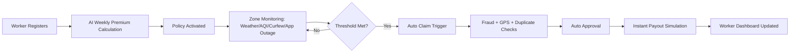
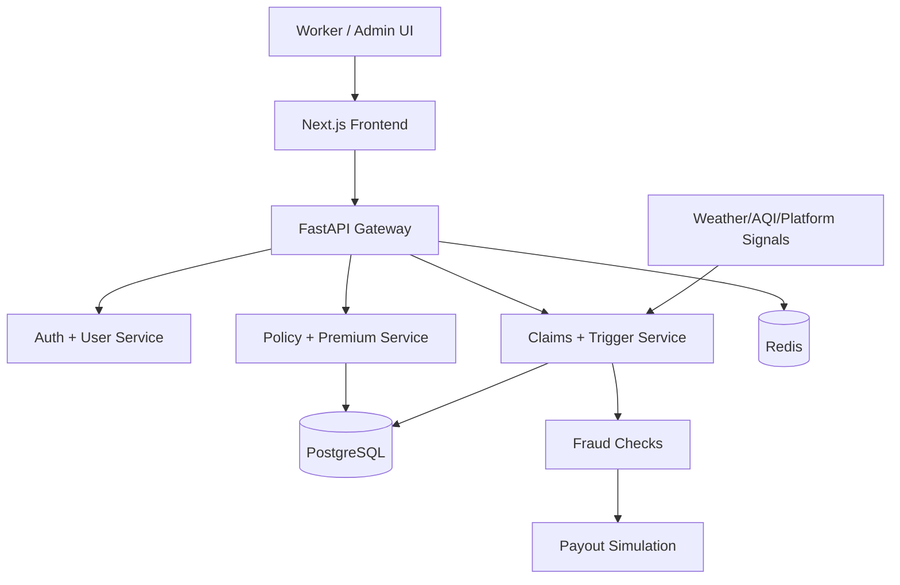

<div align="center">


# 🛡️ GigArmor
### AI-Powered Parametric Income Protection for India’s Gig Workers


<br/>

[](https://nextjs.org/)
[](https://fastapi.tiangolo.com/)
[](https://www.python.org/)
[](https://www.postgresql.org/)
[](https://www.docker.com/)
[](https://gigarmor.vercel.app)

</div>

---

## 🔗 Submission Links

- **Live Demo (Web):** https://gigarmor.vercel.app
- **Repository:** https://github.com/Aayush9808/GigArmor
- **2-Minute Strategy Video (Phase 1):** ADD_LINK_HERE

---

## 🏁 Phase 1 Deliverables (Exact Compliance)

This README is intentionally structured to satisfy every item from the Phase 1 brief.

### Mandatory item 1: Idea document in GitHub README

- ✅ Persona-based requirement + workflow: [Problem Statement](#-problem-statement-persona-first) and [End-to-End Worker Workflow](#-end-to-end-worker-workflow)
- ✅ Weekly premium model + parametric triggers + Web choice: [Weekly Premium Model](#-weekly-premium-model-transparent), [Parametric Trigger Matrix](#-parametric-trigger-matrix-loss-of-income-events), [Why Web First](#-why-web-first)
- ✅ AI/ML integration plan (premium + fraud): [AI/ML Integration Plan](#-aiml-integration-plan)
- ✅ Tech stack + development plan: [Tech Stack](#-tech-stack), [6-Week Plan Alignment](#-6-week-plan-alignment)
- ✅ Market Crash anti-spoofing update: [Adversarial Defense & Anti-Spoofing](#-adversarial-defense--anti-spoofing-strategy-market-crash-update)

### Mandatory item 2: 2-minute public video

- ✅ Link slot present in [Submission Links](#-submission-links)

---

## 🧭 Quick Navigation

- [Phase 1 Submission Snapshot](#-phase-1-march-420-submission-snapshot)
- [Problem Statement](#-problem-statement-persona-first)
- [Solution Summary](#-solution-summary)
- [Worker Workflow](#-end-to-end-worker-workflow)
- [Weekly Premium Model](#-weekly-premium-model-transparent)
- [Parametric Trigger Matrix](#-parametric-trigger-matrix-loss-of-income-events)
- [Adversarial Defense & Anti-Spoofing](#-adversarial-defense--anti-spoofing-strategy-market-crash-update)
- [AI/ML Integration Plan](#-aiml-integration-plan)
- [Product Modules](#️-current-product-modules-implemented)
- [Local Run](#-local-run-instructions)

---

## ✅ Phase 1 (March 4–20) Submission Snapshot

This repository is structured to satisfy **Phase 1: Ideation & Foundation** with both:

- a clear strategic concept document (problem, persona, model, roadmap), and
- a working prototype that demonstrates the core insurtech flow.

### What is submitted today

- ✅ Persona-focused problem definition
- ✅ End-to-end workflow for target worker
- ✅ Weekly premium model (transparent + explainable)
- ✅ Parametric trigger strategy (event → claim → payout)
- ✅ AI/ML integration plan (pricing + fraud + anomaly)
- ✅ Tech stack + execution roadmap
- ✅ Working prototype (worker portal + admin + trigger simulation)
- ✅ Public repository + video placeholder for submission

---

## 🧪 Requirement-to-Implementation Mapping

| Hackathon Requirement | GigArmor Implementation | Status |
|---|---|---|
| AI-powered risk assessment | Worker-level weekly premium scoring from zone + platform + activity | ✅ |
| Weekly pricing model | Premium generated and displayed in weekly format across worker dashboard | ✅ |
| Intelligent fraud detection | GPS/activity/duplicate/anomaly checks in claim flow simulation | ✅ |
| Parametric automation | Trigger engine detects disruption thresholds and auto-fires claims | ✅ |
| Instant payout processing | End-to-end payout simulation with fast settlement UX | ✅ |
| Integration capability (mock acceptable) | Weather/AQI/platform/payment modeled with simulation endpoints and UI | ✅ |
| Loss-of-income only coverage | Trigger catalog and coverage restricted to income disruption events | ✅ |
| Adversarial anti-spoofing strategy | Multi-signal fraud scoring + risk-based routing + human review path | ✅ |

---

## 🏢 Product-Grade Positioning (How to Present)

When presenting to evaluators, position GigArmor as a production-style insurtech platform with three layers:

1. **Risk Intelligence Layer**
	- dynamic weekly pricing,
	- hyper-local signal ingestion,
	- explainable scoring.

2. **Claims Automation Layer**
	- parametric trigger monitoring,
	- fraud + anomaly validation,
	- auto-approval orchestration.

3. **Payout Experience Layer**
	- low-friction settlement flow,
	- transparent claim state progression,
	- worker trust via visible logic.

This framing makes the solution sound not just like a hackathon demo, but a deployable product foundation.

---

## 🎯 Problem Statement (Persona First)

India’s platform delivery workers face direct wage volatility from disruptions they do not control:

- heavy rain / flood,
- severe pollution shutdown,
- curfew / strike,
- platform outage,
- abrupt temporary deactivation.

### Selected Persona

**Food Delivery Partner (Zomato/Swiggy), Tier-1 city, weekly earnings dependent on completed trips.**

### Critical Constraint Compliance

GigArmor is designed for **loss of income only**.

- ✅ Included: income interruption due to external disruptions
- ❌ Excluded: accident cover, health cover, life cover, vehicle repair

---

## 🧠 Solution Summary

GigArmor is an AI-powered parametric insurance platform that:

1. prices risk weekly using zone/platform/activity signals,
2. monitors disruption conditions in real-time,
3. auto-triggers claims when thresholds are met,
4. runs fraud checks,
5. simulates instant payout.

### Why this is differentiated

- **Loss-of-income specific** (strictly compliant with challenge constraints)
- **Weekly model** aligned to gig worker payout cycle
- **Parametric automation** minimizes paperwork and settlement delay
- **Explainable premium logic** for trust and transparency

---

## 🧩 End-to-End Worker Workflow



---

## 💸 Weekly Premium Model (Transparent)

Current model follows a weighted risk score:

```text
riskScore     = 0.5*zoneRisk + 0.3*platformRisk + 0.2*activityScore
weeklyPremium = 30 + 40*riskScore
```

Where:
- `zoneRisk` = disruption likelihood for area,
- `platformRisk` = platform volatility factor,
- `activityScore` = working-days influence.

### Example

- Zone risk: `0.82`
- Platform risk: `0.78`
- Activity score (5/7 days): `0.71`

```text
riskScore ≈ 0.78  =>  premium ≈ ₹61/week
```

This aligns with the challenge requirement: **weekly pricing model**.

---

## ⚡ Parametric Trigger Matrix (Loss-of-Income Events)

| Trigger | Condition Type | Sample Threshold | Auto Claim | Indicative Payout |
|---|---|---|---|---|
| 🌧️ Heavy Rain | Weather API | Rainfall > 50mm/hr for 2 hrs | ✅ | ₹800 |
| 🌊 Flooding | Municipal + weather | Zone flood warning active | ✅ | ₹1,200 |
| 😷 AQI Shutdown | Pollution signal | AQI > 400 + restriction | ✅ | ₹600 |
| 🚫 Curfew / Strike | Civic advisory | Official curfew in zone | ✅ | ₹900 |
| ⚡ App Outage | Platform health | Platform down > 3 hrs | ✅ | ₹500 |
| 💼 Job Loss Signal | Account status | abrupt deactivation pattern | ⚠️ Review-first | ₹2,000 |

All triggers are modeled as **income interruption events only**.

---

## 🧱 Adversarial Defense & Anti-Spoofing Strategy (Market Crash Update)

To address the **Market Crash** scenario (GPS spoofing + synthetic claim rings), GigArmor uses a defense-in-depth model.

### 1) Differentiation: genuine worker vs spoofed actor

Each claim gets a **trust score** from multiple dimensions, not only GPS:

- route plausibility (speed/time feasibility),
- location continuity (sudden geo-jumps flagged),
- disruption correlation (event actually active in zone/time),
- platform activity consistency (online/offline patterns),
- peer corroboration density in micro-zone.

Claims with coherent multi-signal behavior are treated as genuine; inconsistent patterns are flagged.

### 2) Data signals used (beyond basic coordinates)

- Time-series GPS pings (drift, teleport, impossible motion)
- Device/network fingerprint stability
- App session and order-activity metadata
- Zone weather/AQI/flood/civic event timestamp alignment
- Historical claim behavior and duplicate signatures
- Neighbor-worker consistency within 1–2 km cluster

### 3) UX Balance: fraud control without harming honest workers

GigArmor uses **risk-tier routing**:

- **Low risk:** instant auto-approval and payout
- **Medium risk:** soft-friction validation (extra signal checks)
- **High risk:** manual review queue with SLA and reason transparency

This preserves speed for genuine workers while isolating suspicious clusters.

### 4) Ring-Attack Detection Logic (cluster level)

The system monitors sudden claim bursts for patterns like:

- same device/network family across many workers,
- high claim velocity from newly active accounts,
- weak alignment with real disruption geography,
- synchronized claim timestamps with low route plausibility.

When ring probability is high, auto-payout is paused for that cluster only; unaffected workers continue normal flow.

---

## 🏛️ Architecture (High-Level)



---

## 🤖 AI/ML Integration Plan

### 1) Dynamic Premium Engine
- Inputs: zone risk, platform risk, working pattern
- Output: personalized weekly premium with breakdown

### 2) Fraud Detection Layer
- GPS consistency checks
- duplicate claim checks
- anomaly score for unusual patterns

### 3) Predictive Risk Layer
- pre-disruption alerts
- zone severity forecasting

### 4) Explainability Layer
- premium components exposed to user
- risk factors visible on worker dashboard
- clear threshold-to-claim trace for auditability

---

## 🏗️ Current Product Modules (Implemented)

### Worker Experience
- `/login` (demo + real backend support)
- `/register`
- `/dashboard/my-policy` (worker portal)
- `/dashboard/triggers` (parametric simulation)

### Admin Experience
- `/dashboard` overview
- `/dashboard/workers`
- `/dashboard/policies`
- `/dashboard/claims`
- `/dashboard/analytics`
- `/dashboard/risk-map`

### Platform
- FastAPI backend with auth, policies, claims, analytics
- PostgreSQL + Redis
- Dockerized local stack

---

## 🧪 Local Run Instructions

### Prerequisites
- Docker Desktop
- Git

### Run

```bash
git clone https://github.com/Aayush9808/GigArmor.git
cd GigArmor
docker compose up -d --build
```

### Verify services

```bash
docker compose ps
curl http://localhost:8000/health
```

### Access

- Frontend: http://localhost:3000
- Backend: http://localhost:8000
- API Docs: http://localhost:8000/docs

---

## 🔐 Demo Login Credentials

Use these for quick judging flow:

- **Worker Demo:** `+917000000001`
- **Admin Demo:** `+917000000002`
- **Demo OTP:** `123456`

---

## 📽️ README Animation & Visuals

This README already includes:

- animated hero wave banner,
- animated typing headline,
- visual badges for stack + deployment,
- Mermaid workflow + architecture diagrams.

To make it even more premium for final judging, add 2 GIFs inside `docs/assets/`:

```markdown


```

---

## 🗓️ 6-Week Plan Alignment

### Phase 1 (Weeks 1–2) — Ideation & Foundation ✅
- Problem understanding, persona selection, architecture baseline, working prototype

### Phase 2 (Weeks 3–4) — Automation & Protection
- Expand trigger reliability
- strengthen claim orchestration
- tighten fraud checks

### Phase 3 (Weeks 5–6) — Scale & Optimise
- advanced fraud model tuning
- payout integration hardening
- final performance + production polish

---

## 📦 Tech Stack (Product-Oriented)

| Layer | Stack | Why this choice |
|---|---|---|
| Frontend Experience | Next.js 14, TypeScript, Tailwind CSS | Fast UI development, clean dashboard UX, strong component reusability |
| API & Business Logic | FastAPI, Python 3.11, Pydantic, SQLAlchemy | High developer velocity with typed APIs and clear service boundaries |
| Data & State | PostgreSQL, Redis | Reliable transactional storage + fast temporary state/caching for claim workflows |
| Risk & Fraud Logic | Rule-based scoring + anomaly checks (extensible ML path) | Explainable decisions now, smooth upgrade path to learned models later |
| DevOps & Runtime | Docker Compose, Vercel (frontend), containerized backend | Reproducible local setup and simple deployment path for demo-to-prod progression |

### Current architecture style

- **Modular services:** auth, policy, claims, analytics
- **Worker/Admin split:** focused portals for policy actions and operational oversight
- **Parametric flow:** trigger signal → validation → claim decision → payout simulation

---

## 🧭 Why Web First?

We chose web first for Phase 1 because it enables:

- fastest demo and judging access,
- easier dashboard analytics presentation,
- rapid iteration across worker/admin flows,
- lower integration friction while validating core insurance logic.

Mobile/WhatsApp channel remains a planned expansion path for distribution scale.

---

## 🤝 Team Note

Built for **Guidewire DEVTrails 2026** with a focus on practical insurtech outcomes for India’s gig workforce.

---

<div align="center">

### 🚀 GigArmor — From disruption to payout, automatically.

</div>
