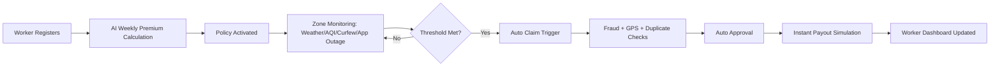
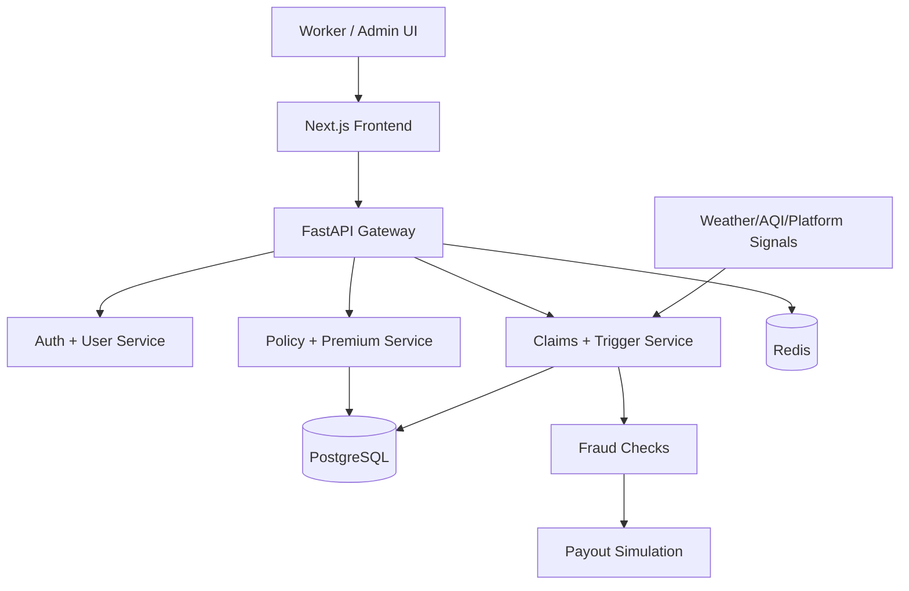

<div align="center">


# 🛡️ GigArmor
### AI-Powered Parametric Income Protection for India’s Gig Workers


<br/>

[](https://nextjs.org/)
[](https://fastapi.tiangolo.com/)
[](https://www.python.org/)
[](https://www.postgresql.org/)
[](https://www.docker.com/)
[](https://gigarmor.vercel.app)

</div>

---

## 🔗 Submission Links

- **Live Demo (Web):** https://gigarmor.vercel.app
- **Repository:** https://github.com/Aayush9808/GigArmor
- **2-Minute Strategy Video (Phase 1):** ADD_LINK_HERE

> Replace `ADD_LINK_HERE` before final submission.

---

## 🧭 Quick Navigation

- [Phase 1 Submission Snapshot](#-phase-1-march-420-submission-snapshot)
- [Problem Statement](#-problem-statement-persona-first)
- [Solution Summary](#-solution-summary)
- [Worker Workflow](#-end-to-end-worker-workflow)
- [Weekly Premium Model](#-weekly-premium-model-transparent)
- [Parametric Trigger Matrix](#-parametric-trigger-matrix-loss-of-income-events)
- [AI/ML Integration Plan](#-aiml-integration-plan)
- [Product Modules](#️-current-product-modules-implemented)
- [Demo Script](#-demo-script-use-in-2-min-video)
- [Local Run](#-local-run-instructions)

---

## ⚡ Judge in 90 Seconds

1. Open live app: **https://gigarmor.vercel.app**
2. Login as worker: **+917000000001**
3. OTP: **123456**
4. Open **My Policy** and submit a simulated claim
5. Open **Triggers** and run auto-trigger payout simulation

---

## ✅ Phase 1 (March 4–20) Submission Snapshot

This repository is structured to satisfy **Phase 1: Ideation & Foundation** with both:

- a clear strategic concept document (problem, persona, model, roadmap), and
- a working prototype that demonstrates the core insurtech flow.

### What is submitted today

- ✅ Persona-focused problem definition
- ✅ End-to-end workflow for target worker
- ✅ Weekly premium model (transparent + explainable)
- ✅ Parametric trigger strategy (event → claim → payout)
- ✅ AI/ML integration plan (pricing + fraud + anomaly)
- ✅ Tech stack + execution roadmap
- ✅ Working prototype (worker portal + admin + trigger simulation)
- ✅ Public repository + video placeholder for submission

---

## 🎯 Problem Statement (Persona First)

India’s platform delivery workers face direct wage volatility from disruptions they do not control:

- heavy rain / flood,
- severe pollution shutdown,
- curfew / strike,
- platform outage,
- abrupt temporary deactivation.

### Selected Persona

**Food Delivery Partner (Zomato/Swiggy), Tier-1 city, weekly earnings dependent on completed trips.**

### Critical Constraint Compliance

GigArmor is designed for **loss of income only**.

- ✅ Included: income interruption due to external disruptions
- ❌ Excluded: accident cover, health cover, life cover, vehicle repair

---

## 🧠 Solution Summary

GigArmor is an AI-powered parametric insurance platform that:

1. prices risk weekly using zone/platform/activity signals,
2. monitors disruption conditions in real-time,
3. auto-triggers claims when thresholds are met,
4. runs fraud checks,
5. simulates instant payout.

### Why this is differentiated

- **Loss-of-income specific** (strictly compliant with challenge constraints)
- **Weekly model** aligned to gig worker payout cycle
- **Parametric automation** minimizes paperwork and settlement delay
- **Explainable premium logic** for trust and transparency

---

## 🧩 End-to-End Worker Workflow



---

## 💸 Weekly Premium Model (Transparent)

Current model follows a weighted risk score:

```text
riskScore     = 0.5*zoneRisk + 0.3*platformRisk + 0.2*activityScore
weeklyPremium = 30 + 40*riskScore
```

Where:
- `zoneRisk` = disruption likelihood for area,
- `platformRisk` = platform volatility factor,
- `activityScore` = working-days influence.

### Example

- Zone risk: `0.82`
- Platform risk: `0.78`
- Activity score (5/7 days): `0.71`

```text
riskScore ≈ 0.78  =>  premium ≈ ₹61/week
```

This aligns with the challenge requirement: **weekly pricing model**.

---

## ⚡ Parametric Trigger Matrix (Loss-of-Income Events)

| Trigger | Condition Type | Sample Threshold | Auto Claim | Indicative Payout |
|---|---|---|---|---|
| 🌧️ Heavy Rain | Weather API | Rainfall > 50mm/hr for 2 hrs | ✅ | ₹800 |
| 🌊 Flooding | Municipal + weather | Zone flood warning active | ✅ | ₹1,200 |
| 😷 AQI Shutdown | Pollution signal | AQI > 400 + restriction | ✅ | ₹600 |
| 🚫 Curfew / Strike | Civic advisory | Official curfew in zone | ✅ | ₹900 |
| ⚡ App Outage | Platform health | Platform down > 3 hrs | ✅ | ₹500 |
| 💼 Job Loss Signal | Account status | abrupt deactivation pattern | ⚠️ Review-first | ₹2,000 |

All triggers are modeled as **income interruption events only**.

---

## 🏛️ Architecture (High-Level)



---

## 🤖 AI/ML Integration Plan

### 1) Dynamic Premium Engine
- Inputs: zone risk, platform risk, working pattern
- Output: personalized weekly premium with breakdown

### 2) Fraud Detection Layer
- GPS consistency checks
- duplicate claim checks
- anomaly score for unusual patterns

### 3) Predictive Risk Layer
- pre-disruption alerts
- zone severity forecasting

### 4) Explainability Layer
- premium components exposed to user
- risk factors visible on worker dashboard
- clear threshold-to-claim trace for auditability

---

## 🏗️ Current Product Modules (Implemented)

### Worker Experience
- `/login` (demo + real backend support)
- `/register`
- `/dashboard/my-policy` (worker portal)
- `/dashboard/triggers` (parametric simulation)

### Admin Experience
- `/dashboard` overview
- `/dashboard/workers`
- `/dashboard/policies`
- `/dashboard/claims`
- `/dashboard/analytics`
- `/dashboard/risk-map`

### Platform
- FastAPI backend with auth, policies, claims, analytics
- PostgreSQL + Redis
- Dockerized local stack

---

## 🎬 Demo Script (Use in 2-Min Video)

1. Show homepage + value proposition.
2. Login as worker demo.
3. Open **My Policy** page (weekly premium + coverage).
4. File a claim (simulate disruption).
5. Show AI fraud checks and payout countdown.
6. Open **Triggers** page and run auto-trigger simulation.
7. Close with roadmap (Phase 2/3).

### Presentation Tip
Keep each step under ~15 seconds and focus on one narrative:
**“External disruption happened → system detected it → worker got protected income.”**

---

## 🧪 Local Run Instructions

### Prerequisites
- Docker Desktop
- Git

### Run

```bash
git clone https://github.com/Aayush9808/GigArmor.git
cd GigArmor
docker compose up -d --build
```

### Verify services

```bash
docker compose ps
curl http://localhost:8000/health
```

### Access

- Frontend: http://localhost:3000
- Backend: http://localhost:8000
- API Docs: http://localhost:8000/docs

---

## 🔐 Demo Login Credentials

Use these for quick judging flow:

- **Worker Demo:** `+917000000001`
- **Admin Demo:** `+917000000002`
- **Demo OTP:** `123456`

---

## 📽️ README Animation & Visuals

This README already includes:

- animated hero wave banner,
- animated typing headline,
- visual badges for stack + deployment,
- Mermaid workflow + architecture diagrams.

To make it even more premium for final judging, add 2 GIFs inside `docs/assets/`:

```markdown


```

---

## 🗓️ 6-Week Plan Alignment

### Phase 1 (Weeks 1–2) — Ideation & Foundation ✅
- Problem understanding, persona selection, architecture baseline, working prototype

### Phase 2 (Weeks 3–4) — Automation & Protection
- Expand trigger reliability
- strengthen claim orchestration
- tighten fraud checks

### Phase 3 (Weeks 5–6) — Scale & Optimise
- advanced fraud model tuning
- payout integration hardening
- final performance + production polish

---

## 📦 Tech Stack

- **Frontend:** Next.js 14, TypeScript, Tailwind CSS
- **Backend:** FastAPI, Python 3.11, SQLAlchemy
- **Data:** PostgreSQL, Redis
- **Infra:** Docker Compose
- **ML Layer:** scoring + anomaly pipeline (progressive)

---

## 🧭 Why Web First?

We chose web first for Phase 1 because it enables:

- fastest demo and judging access,
- easier dashboard analytics presentation,
- rapid iteration across worker/admin flows,
- lower integration friction while validating core insurance logic.

Mobile/WhatsApp channel remains a planned expansion path for distribution scale.

---

## 📸 Presentation Enhancements (Optional)

You can add your own assets in a folder like `docs/assets/` and plug them here:

```markdown


```

---

## 🤝 Team Note

Built for **Guidewire DEVTrails 2026** with a focus on practical insurtech outcomes for India’s gig workforce.

If you are a judge/reviewer, the fastest path is:

1. Open live demo,
2. Login with worker credentials,
3. Run claim + trigger simulation,
4. Review README sections for model and roadmap.

---

<div align="center">

### 🚀 GigArmor — From disruption to payout, automatically.

</div>
