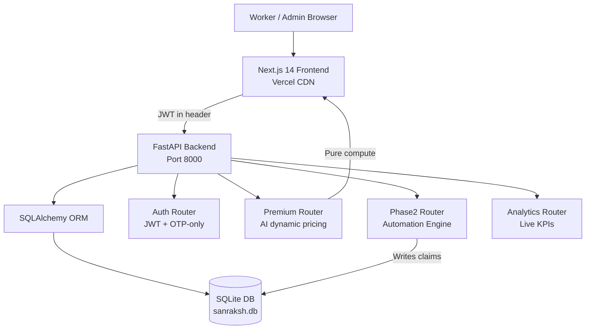

<div align="center">


# ⚙️ Phase 2 — Build & Ship
### Full-Stack Implementation · Real APIs · Demo Mode · Dynamic AI Pricing


<br/>

[](https://fastapi.tiangolo.com/)
[](https://sqlite.org/)
[](https://nextjs.org/)
[](https://sanraksh.vercel.app)

</div>

---

## 🔗 Phase 2 Submission Links

- **Live Demo:** https://sanraksh.vercel.app
- **Repository:** https://github.com/Aayush9808/GigArmor *(project renamed Sanraksh after Phase 1 submission)*
- **Local Setup Guide:** [LOCAL_SETUP.md](../LOCAL_SETUP.md)
- **Phase 1 Submission:** [submissions/PHASE1.md](./PHASE1.md)

> **Note on naming:** The project was submitted as "GigArmor" in Phase 1. It was renamed to **Sanraksh** (Sanskrit: "to protect") before Phase 2 to better reflect the product's mission and audience.

---

## 🎯 Phase 2 Objective

Phase 1 delivered a complete prototype with every screen functional. **Phase 2's mandate:** make it real, make it polished, and make it demeable by a judge in 30 seconds.

> Every API call hits a live backend. Every number comes from a database. Premium pricing is computed dynamically, not from a plan catalogue. Any judge can onboard end-to-end without signing up — via Demo Mode.

---

## ✅ What Was Built in Phase 2

### 1. Backend — Fully Operational

| Component | Detail |
|---|---|
| **Database** | SQLAlchemy 2.0 + SQLite — zero Docker dependency, runs anywhere |
| **Auth** | JWT (python-jose) + OTP-only login (no password storage) |
| **Seed Data** | 11 users · 8 policies · 11 claims · 5 disruptions · 7 risk zones |
| **Config** | Pydantic Settings with sensible defaults — no env file required |
| **API Docs** | Auto-generated Swagger at `/docs` |

### 2. API Endpoints — All Live

```
GET  /api/v1/workers/all              — live worker list from DB
GET  /api/v1/claims/all               — claims with fraud score + decision trace
GET  /api/v1/analytics/dashboard      — live KPIs: users, claims, payout, automation rate
GET  /api/v1/analytics/claims-summary — 7-day claims + payout trend
GET  /api/v1/analytics/policy-mix     — coverage type breakdown
GET  /api/v1/disruptions/active       — active disruptions from DB
POST /api/v1/phase2/simulate-disruption — real automation engine run
POST /api/v1/premium/calculate        — AI dynamic premium (₹10–₹60/wk)
POST /api/v1/auth/send-otp            — OTP dispatch (phone-based)
POST /api/v1/auth/verify-otp          — JWT token issue
GET  /api/v1/workers/me               — authenticated worker profile
GET  /api/v1/workers/me/policy        — worker's active policy
GET  /api/v1/workers/me/claims        — worker's claim history
```

### 3. Frontend — Redesigned from Phase 1

The entire worker-facing UI was redesigned between phases. Key changes:

| Area | Phase 1 | Phase 2 |
|---|---|---|
| Auth | Email + password form | **OTP-only** (phone → 6-digit code) |
| Pricing | Fixed plans (Lite / Standard / Pro cards) | **Dynamic AI pricing** — ₹10–₹60/wk, no plan selection |
| Worker nav | 5 tabs incl. My Premium (separate page) | 6 streamlined tabs — premium merged into My Policy |
| Dashboard KPIs | Hardcoded numbers | Live from backend analytics API |
| Onboarding | Click-through form | **Demo Mode** — auto-fill at every step |
| Landing page | Listed fixed plan prices | Explains AI pricing, no price cards |

All 6 admin dashboard pages consume live APIs (no mock arrays).

### 4. Dynamic AI Premium — No Fixed Plans

Premium is no longer a tiered plan. It is computed per-worker on the backend:

```
weekly_premium = 10 + (city_risk × 6) + (min(platforms, 4) × 4) + (earnings / 2000)
                 capped between ₹10 and ₹60
```

| Factor | How it affects premium |
|---|---|
| City Risk | Mumbai / Delhi / Bengaluru = higher base risk |
| Platform Count | More platforms = more income exposure |
| Weekly Earnings | Higher earner → higher coverage → higher premium |

The worker sees their personalised weekly rate on My Policy — not a plan card.

### 5. Demo Mode — Judges Onboard in 30 Seconds

Every friction point in the onboarding flow was removed for demo purposes:

| Step | Demo shortcut |
|---|---|
| Register | "Use Demo Credentials" fills name + phone |
| Aadhaar verification | Modal with 1.5 s fake loading — no UIDAI call |
| OTP verification | "Fill Demo OTP" fills 123456, auto-advances |
| Platform selection | "Use Demo Data" auto-selects Swiggy / Blinkit / Zomato |
| Premium review | Shows personalised rate computed from demo data |
| Sidebar | Persistent 🎭 Demo Mode badge throughout session |

Judges can complete the full worker onboarding in under 30 seconds without entering any real personal data.

### 6. Automation Engine — Real Decision Logic

`POST /api/v1/phase2/simulate-disruption` creates live database records and runs the full evaluation:

1. Creates a real disruption record in SQLite
2. Finds all active workers in the affected zone
3. Evaluates multi-signal fraud score per worker
4. Applies decision rules (route auto-pay, fraud threshold, KYC, GPS verify)
5. Creates real `Claim` records with `PAID` / `PENDING` / `REJECTED` status
6. Returns full decision trace with reason-codes

**Sample real response:**
```json
{
  "targeted_workers": 3,
  "created_claims": 3,
  "auto_paid_count": 2,
  "total_payout": 1600.0,
  "avg_fraud_score": 0.18,
  "signal_confidence": 0.72,
  "decision_trace_samples": [
    {
      "claim_number": "CLM-2026-XXXX",
      "status": "paid",
      "fraud_score": 0.12,
      "reasons": ["ROUTE_AUTO_PAY", "FRAUD_SCORE_LOW", "KYC_VERIFIED", "GPS_ZONE_MATCH"]
    }
  ],
  "estimated_settlement_seconds": 25
}
```

### 7. CI/CD Pipeline

```
✅ CI/CD / lint           — flake8 backend linting
✅ CI/CD / test-backend   — 16 pytest tests passing
✅ CI/CD / test-frontend  — 15 Jest tests passing
✅ Vercel                 — Production deploy on every push to main
```

---

## 🗂️ Worker Portal — Current Pages

| Page | Route | What it shows |
|---|---|---|
| Overview | `/dashboard` | KPI cards · live triggers summary · earnings graph |
| Live Triggers | `/dashboard/triggers` | Active disruptions · real-time status · claim countdown |
| My Policy | `/dashboard/my-policy` | Coverage details · personalised weekly premium · claim history |
| Simulation | `/dashboard/simulation` | Interactive disruption simulator with fraud score output |
| Profile | `/dashboard/profile` | Personal details · KYC status · platform connections |
| Customer Care | `/dashboard/support` | FAQ · quick links · contact form |

---

## 🏗️ Phase 2 Architecture



---

## 🧪 Backend Test Coverage (16 Tests)

```
tests/test_auth.py       — password hashing, JWT create/decode/expiry, OTP generation/verify
tests/test_phase2.py     — automation engine: signal ingestion, fraud scoring, reason codes
tests/test_policies.py   — premium calculation: base, high-risk city, platform count, earnings band
```

---

## 🚀 Run Locally

> **See [LOCAL_SETUP.md](../LOCAL_SETUP.md) for the full guide with screenshots.**

```bash
git clone https://github.com/Aayush9808/GigArmor.git
cd GigArmor/gigshield-dev

# Backend
cd backend
python -m venv .venv && source .venv/bin/activate
pip install -r requirements_local.txt
uvicorn app.main:app --port 8000
# Auto-seeds database on first run

# Frontend (new terminal)
cd ../frontend
npm install && npm run dev
# → http://localhost:3000
```

**Demo credentials:**

| Role | Phone | OTP |
|---|---|---|
| Admin | `9999000000` | `000000` |
| Worker | `9999000001` | `123456` |

Or use the **🎭 Demo Mode** button on the register page to onboard as a new user without any real data.

---

## 📊 Phase 2 By The Numbers

| Metric | Value |
|---|---|
| Backend files changed | 18 |
| Frontend pages rewritten | 7 |
| New features shipped | Demo Mode, Dynamic Pricing, OTP-only auth |
| API endpoints live | 13 |
| Seed records | 43 (users + policies + claims + disruptions + zones) |
| CI test cases | 16 |
| Fixed plan tiers | **0** (fully dynamic) |
| Mock data remaining | **0** |

---

<div align="center">

### ⚙️ Phase 2 — Prototype → Product → Demeable in 30 seconds.

**[← Back to main README](../README.md)** · **[Phase 1 Submission](./PHASE1.md)** · **[Local Setup Guide](../LOCAL_SETUP.md)**

</div>
