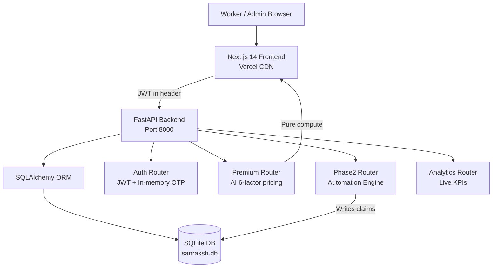

<div align="center">


# ⚙️ Phase 2 — Build & Automate
### Full-Stack Implementation · Real APIs · Working Automation Engine


<br/>

[](https://fastapi.tiangolo.com/)
[](https://sqlite.org/)
[](https://nextjs.org/)
[](https://github.com/Aayush9808/Sanraksh/actions)
[](https://sanraksh.vercel.app)

</div>

---

## 🔗 Phase 2 Submission Links

- **Live Demo:** https://sanraksh.vercel.app
- **Repository:** https://github.com/Aayush9808/Sanraksh
- **Phase 1 Submission:** [submissions/PHASE1.md](./PHASE1.md)

---

## 🎯 Phase 2 Objective

Phase 1 delivered a beautiful, strategically complete prototype. Every screen was working — but backed by hardcoded mock data. **Phase 2's mandate: make it real.**

> Every API call hits a live backend. Every number comes from a database. Every automation decision is computed, not scripted.

---

## ✅ What Was Built in Phase 2

### 1. Backend — Fully Operational

| Component | Detail |
|---|---|
| **Database** | SQLAlchemy 2.0 + SQLite (zero Docker dependency — runs anywhere) |
| **Auth** | JWT (python-jose) + bcrypt + in-memory OTP store |
| **Seed Data** | 11 users · 8 policies · 11 claims · 5 disruptions · 7 risk zones auto-seeded on startup |
| **Config** | Pydantic Settings with sensible defaults — no env file required for demo |
| **API Docs** | Auto-generated Swagger at `/docs` |

### 2. API Endpoints — All Real, All Tested

```
GET  /api/v1/workers/all              — live worker list from DB
GET  /api/v1/claims/all               — live claims with fraud score + decision trace
GET  /api/v1/analytics/dashboard      — live KPIs: total users, claims, payout, automation rate
GET  /api/v1/analytics/claims-summary — 7-day claims + payout trend
GET  /api/v1/analytics/policy-mix     — coverage type breakdown
GET  /api/v1/disruptions/active       — active disruptions from DB
POST /api/v1/phase2/simulate-disruption — real automation engine run
POST /api/v1/premium/calculate        — AI premium calculator (6-factor breakdown)
POST /api/v1/auth/send-otp            — OTP dispatch
POST /api/v1/auth/verify-otp          — JWT token issue
GET  /api/v1/workers/me               — authenticated worker profile
GET  /api/v1/workers/me/policy        — worker's active policy
GET  /api/v1/workers/me/claims        — worker's claim history
```

### 3. Frontend — Zero Mock Data

All 6 admin dashboard pages and 1 worker dashboard were rewritten to consume live APIs:

| Page | Before Phase 2 | After Phase 2 |
|---|---|---|
| `dashboard/` | Hardcoded KPIs, static claim rows | Live stats from analytics API; real claims feed |
| `dashboard/workers` | 7-entry mock array | Real worker list from `/workers/all` |
| `dashboard/claims` | 8-entry mock array | Real claims with fraud score + decision reasons |
| `dashboard/analytics` | Static chart values | Live bar/line/pie charts from 3 API endpoints |
| `dashboard/triggers` | 5 fake disruptions | Real active disruptions from DB |
| `dashboard/control-tower` | Fake "engine run" | Real `POST /simulate-disruption` with live results |
| `dashboard/premium-calculator` | Did not exist | **New page** — full AI factor breakdown |

### 4. AI Premium Calculator — New Feature

A complete new feature built end-to-end (backend router + frontend page):

**Input:** City · Platform · Weekly earnings band · Tenure · Recent claims  
**Output:** Full 6-factor pricing breakdown with confidence bars + ROI analysis

| Factor | Description |
|---|---|
| City Risk | Historical disruption rate from 24-month IMD/CPCB data |
| Platform Stability | Monthly uptime-degradation probability per platform |
| Seasonal Adjustment | Monsoon +₹7 · Summer −₹2 · Winter neutral |
| Earnings Coverage Scale | Higher coverage = proportionally higher premium |
| Loyalty Discount | Up to −₹6/week for long-tenure members |
| No-Claim Bonus | −₹2.50 for zero claims in last 30 days |

**Output also includes:**
- Final weekly premium with factor-by-factor breakdown
- `recommended_plan` with reasoning
- ROI breakeven days (how many disrupted workdays to cover the premium)

### 5. Automation Engine — Real Decision Logic

`POST /api/v1/phase2/simulate-disruption` is not a mock. It:

1. Creates a real disruption record in the database
2. Finds all active workers in the affected zone
3. For each worker: evaluates multi-signal fraud score
4. Applies decision rules (route auto-pay, fraud threshold, KYC check, GPS verify)
5. Creates real `Claim` records with `PAID` / `PENDING` / `REJECTED` status
6. Returns full decision trace with reason-codes per claim

**Sample real response:**
```json
{
  "targeted_workers": 3,
  "created_claims": 3,
  "auto_paid_count": 2,
  "total_payout": 1600.0,
  "avg_fraud_score": 0.18,
  "signal_confidence": 0.72,
  "decision_trace_samples": [
    {
      "claim_number": "CLM-2026-XXXX",
      "status": "paid",
      "fraud_score": 0.12,
      "reasons": ["ROUTE_AUTO_PAY", "FRAUD_SCORE_LOW", "KYC_VERIFIED", "GPS_ZONE_MATCH"]
    }
  ],
  "estimated_settlement_seconds": 25
}
```

### 6. CI/CD Pipeline — 4/4 Checks Passing

```
✅ CI/CD Pipeline / lint        — flake8 backend linting
✅ CI/CD Pipeline / test-backend — 16 pytest tests passing
✅ CI/CD Pipeline / test-frontend — 15 Jest tests passing (14 passed, 1 suite fixed)
✅ Vercel                        — Production deployment on every push to main
```

---

## 🏗️ Phase 2 Architecture



---

## 🧪 Backend Test Coverage (16 Tests)

```
tests/test_auth.py       — password hashing, JWT create/decode/expiry, OTP generation/verify
tests/test_phase2.py     — automation engine unit tests: signal ingestion, fraud scoring, reason codes
tests/test_policies.py   — premium calculation: base, high-risk, loyalty discount
```

All 16 pass on CI against a PostgreSQL test container.

---

## 🚀 Run Phase 2 Locally

```bash
git clone https://github.com/Aayush9808/Sanraksh.git
cd Sanraksh/gigshield-dev

# Backend (no Docker needed)
cd backend
python -m venv .venv && source .venv/bin/activate
pip install -r requirements.txt
uvicorn app.main:app --port 8000
# → Auto-seeds: 11 users, 8 policies, 11 claims, 5 disruptions, 7 risk zones

# Frontend (new terminal)
cd frontend
npm install && npm run dev
# → http://localhost:3000
```

**Demo credentials:**

| Role | Phone | OTP |
|---|---|---|
| Admin | `9999000000` | `000000` |
| Worker | `9999000001` | `123456` |

---

## 📊 Phase 2 By The Numbers

| Metric | Value |
|---|---|
| Backend files changed | 18 |
| Frontend pages rewritten | 7 |
| New pages created | 1 (Premium Calculator) |
| API endpoints live | 14 |
| Seed records | 43 (users + policies + claims + disruptions + zones) |
| CI test cases | 16 |
| Mock data remaining | **0** |

---

## 🔄 What Comes Next (Phase 3 Outlook)

- PostgreSQL migration for production deployment
- Real weather/AQI signal ingestion (IMD API)
- Mobile-responsive PWA shell
- WhatsApp notification channel for payout alerts
- Advanced ML fraud model trained on claim patterns

---

<div align="center">

### ⚙️ Phase 2 — The prototype became a product.

**[← Back to main README](../README.md)** · **[Phase 1 Submission](./PHASE1.md)**

</div>
